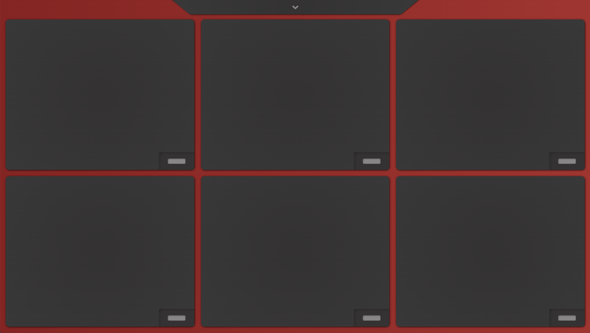

# TR Beat Pad
The TR Beat Pad is a fully functional and responsive audio triggering device.  The user can touch each pad and trigger a sound with preloaded audio files that were created in Pro Tools and Ableton. This application works on touch screens as well as desktops. When on the desktop - the user can trigger each sound using these keys: 'W E R A S D'

The user can switch between drum kits using the dropdown menu at the top of the screen. When on a smaller tablet or smartphone, the user will be prompted to turn the screen to landscape mode for a better user experience.

The design of this application was inspired by the Roland SPD-SX sampling pad.

# Technologies Used

- React
- JavaScript
- CSS
- SASS
- ProTools
- Ableton

# Screenshots

# Getting Started

<<<<<<< HEAD
[Click here](https://trbeatpad.netlify.app){:target="_blank"} to see the deployed project 
<a href="https://trbeatpad.netlify.app" target="_blank">Link</a>
=======
[Click here](https://trbeatpad.netlify.app) to see the deployed project 
>>>>>>> 7e9a70730b6004361aadd216e534327d35f8418e

# Future Enhancements
- Allow users to play the pad in full screen mode
- Allow the user to record new sounds and play them on a pad
- Integrate a record feature where the user can record their drum patterns
- Have the user access this application through phone home screen
